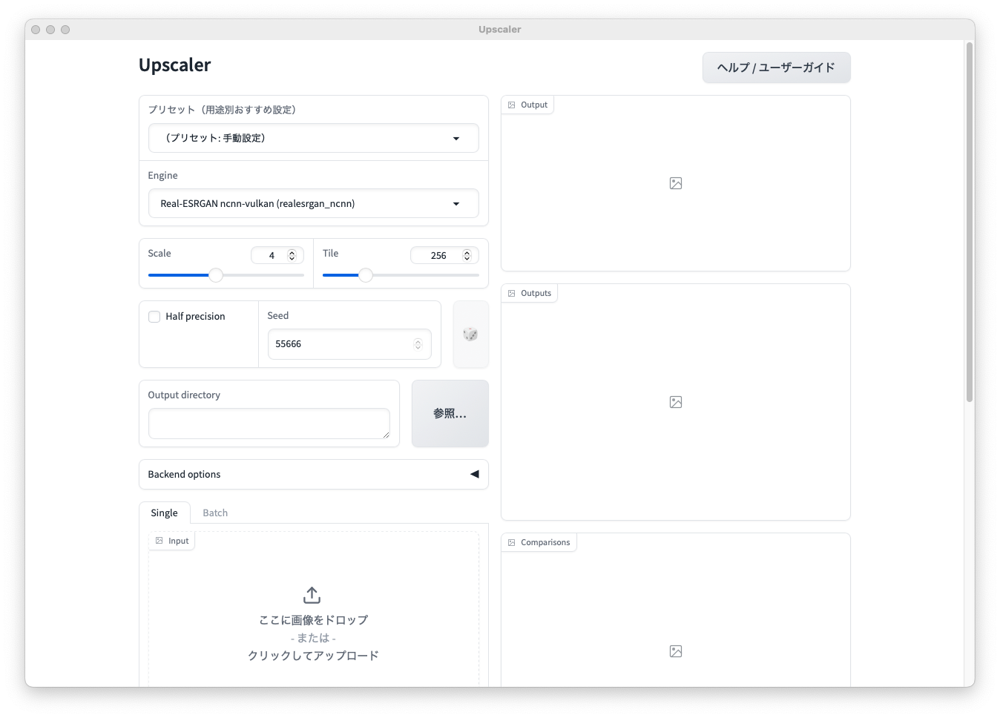

# Upscaler (upscaler_mac)

画像アップスケーラー実験用のシンプルな GUI です。**Apple Silicon の macOS** を対象に開発しています。

軽量な確認用として Pillow Lanczos と Real-ESRGAN を置きつつ、Apple Silicon の Metal (MPS) を活かす高品質候補として Spandrel (HAT/SwinIR/DAT/ESRGAN系) と A-ESRGAN を接続できるようにしています。MSA-ESRGAN は論文上は有望ですが、現時点でそのままGUIから呼び出せる標準的な公式推論実装や重み配布が見つけにくいため、まずは外部コマンド枠で接続できるようにしてあります。



## 対応環境 / Platform

- **対象: Apple Silicon (M1/M2/...) の macOS。** ここでのみ動作確認しています。
- Windows / Linux / Intel Mac は**非サポート**です（一部バックエンドはクロスプラットフォームですが、保証しません）。
- 本体コードは **MIT License** です。他プラットフォームへの移植はご自由にどうぞ。
- 各モデルの重みは同梱しません。モデルにはそれぞれのライセンスがあり、**非商用に限られるものもあります**（例: A-ESRGAN）。利用前に各配布元のライセンスを確認してください。

## Quick Start

```bash
git clone https://github.com/pyoru0309/upscaler_mac.git
cd upscaler_mac
python3 -m venv .venv
source .venv/bin/activate
python -m pip install --upgrade pip
python -m pip install -r requirements.txt
python scripts/setup_models.py   # 推奨モデル(Spandrel用)を取得（任意）
python app.py
```

起動後、ブラウザで `http://127.0.0.1:7860` を開きます。7860番が埋まっている場合は近い空きポートで起動します。

モデルや実行ファイルの取得は [モデルのセットアップ](#models) を参照してください。アプリ内の「ヘルプ / ユーザーガイド」ボタン、または `http://127.0.0.1:7860/guide/` でユーザーガイドを開けます。

## Desktop App (Tauri)

ブラウザを開かずネイティブウィンドウで使いたい場合は、Tauri製の薄いラッパーを使えます。GradioサーバをそのままサブプロセスとしてSpawnし、起動完了後にWebViewで表示するだけの構成です（Pythonは同梱せず既存の `.venv` を使います）。

前提: Rust ツールチェーン（`cargo`）と、上記の Quick Start で作成済みの `.venv`。

```bash
cd src-tauri
cargo run                              # 開発実行
npx --yes @tauri-apps/cli@^2 build     # .app / .dmg を生成
```

### ダブルクリックで起動するアプリ化

`npx tauri build` で配布物が生成されます。

- `src-tauri/target/release/bundle/macos/Upscaler.app` … Finderからダブルクリックで起動
- `src-tauri/target/release/bundle/dmg/Upscaler_<ver>_aarch64.dmg` … 配布用ディスクイメージ

ビルドした `.app` には開発時のプロジェクトの絶対パスが埋め込まれるため、**同じマシン内であれば `.app` を任意の場所（`/Applications` 等）へ移動してもプロジェクト直下の `app.py` と `.venv` を見つけて起動します**。開発環境のまま普段使いのアプリとして扱う用途に向いています。

### 仕組み・挙動

- 起動URLは `app.py` が出力する `UPSCALER_URL=...` マーカーから取得するため、動的ポートでも確実に追従します。
- ウィンドウを閉じる/アプリを終了すると Gradio サーバも停止します。さらに `UPSCALER_PARENT_PID` を渡しており、ラッパーがクラッシュ／強制終了してもPython側が親プロセスの消滅を検知して自発終了します。
- Python実行ファイルは `.venv` を自動検出します。変更する場合は `UPSCALER_PYTHON` で上書きできます。

### ネイティブダイアログ連携

Tauriラッパー上では、以下のOS標準ダイアログが使えます（純ブラウザ起動時はボタンが無効動作になり、テキスト手入力にフォールバック）。

- 出力ディレクトリ横の「参照…」: フォルダ選択ダイアログ
- バッチタブの入力ディレクトリ横の「参照…」: フォルダ選択ダイアログ
- 単体タブの「ファイルを選択…」: 画像ファイル選択ダイアログ（ドラッグ＆ドロップに加えて利用可）

選択したパスは macOS の NFD（分解形）から NFC へ正規化してから扱います（日本語の濁点・半濁点などを含むパス対策）。

### 設定の永続化

エンジン・スケール・タイル・半精度・シード・各バックエンドモデル・出力先・入力ディレクトリ・再帰フラグは、実行のたびに `user_prefs.json`（プロジェクト直下）へ保存され、次回起動時の既定値として復元されます。

## Features

- 単体画像アップスケール
- 複数画像のバッチアップスケール
- ディレクトリ入力
- 出力ギャラリー
- ジョブID付き出力ファイル名による上書き防止
- 入力/出力の横並び比較画像: `*.compare.png`
- バックエンド検出
- 実行履歴: `outputs/history.jsonl`
- 出力ごとの設定マニフェスト: `*.png.json`
- バッチ実行レポート: `batch_report_*.md`
- CLI実行: `python -m upscaler.cli`
- 設定の永続化: `user_prefs.json`
- デスクトップアプリ化(Tauri)とOSネイティブのファイル/フォルダ選択ダイアログ
- 同梱ユーザーガイド(zensical)とアプリ内ヘルプボタン
- モデルダウンローダ: `python scripts/setup_models.py`

<a name="models"></a>
## Models（セットアップ）

GitHubから配布されたソースには重み本体は含まれません。`scripts/setup_models.py` で各バックエンドのアセットを取得できます。

```bash
python scripts/setup_models.py                 # 既定: Spandrel用の推奨重み(RealESRGAN_x4plus.pth)
python scripts/setup_models.py spandrel        # Spandrel(MPS)用 .pth
python scripts/setup_models.py realesrgan      # Real-ESRGAN ncnn-vulkan 実行ファイル
python scripts/setup_models.py aesrgan         # A-ESRGAN のリポジトリ+重み
python scripts/setup_models.py all             # すべて
python scripts/setup_models.py spandrel --model realesrgan-x4plus-anime
python scripts/setup_models.py spandrel --model swinir-realsr-x4   # SwinIR(高品質Transformer)
```

Spandrel(MPS)で使える高品質モデル: `realesrgan-x4plus` / `realesrgan-x4plus-anime` / `swinir-realsr-x4-large` / `swinir-realsr-x4` / `swinir-classical-x4`。HAT / DAT は spandrel が対応していますが直接DL URLが無いため、配布元から `.pth` を取得して `models/spandrel/` に置いてください。

ダウンロード済みのファイルはスキップします。詳細は各 Backends セクションを参照してください。

## User Guide（ユーザーガイド）

ユーザーガイドは [zensical](https://pypi.org/project/zensical/) で `user_guide/` から `docs/` に静的サイトとして生成します。

```bash
zensical build          # docs/ を生成
zensical serve          # http://127.0.0.1:8080 でプレビュー
```

アプリ起動中は `docs/` を `/guide` で配信します。アプリ内の「ヘルプ / ユーザーガイド」ボタン、または `http://127.0.0.1:<port>/guide/` で開けます。パラメータ設定の解説は `user_guide/reference/parameters.md` にまとまっています。

## CLI

```bash
python -m upscaler.cli --input inputs/example.png --engine pillow_lanczos --scale 2
python -m upscaler.cli --input inputs/ --recursive --engine pillow_lanczos --scale 2
python -m upscaler.cli --input inputs/example.png --output-dir outputs/custom --engine pillow_lanczos --scale 2
python -m upscaler.cli --list-engines
python -m upscaler.cli --history
```

バックエンドID:

- `aesrgan`
- `spandrel_mps`
- `realesrgan_ncnn`
- `external_command`
- `pillow_lanczos`

実行中はGUIの `Stop` ボタンで途中キャンセルできます（単体・バッチとも）。インプロセス系（Spandrel/Pillow）はタイル境界で、サブプロセス系（Real-ESRGAN/A-ESRGAN/External）はプロセス終了で停止します。キャンセルされたジョブは履歴に `cancelled` として記録されます。バッチ実行では1枚ごとに進捗とギャラリーが更新されます。

## Backends

### Pillow Lanczos

依存確認用のフォールバックです。AIアップスケールではありません。

### Real-ESRGAN ncnn-vulkan

Real-ESRGAN の軽量な標準バックエンドです。`realesrgan-ncnn-vulkan` が `PATH` にあるか、次の環境変数で実行ファイルを指定してください。

```bash
export UPSCALER_REALESRGAN_BIN=/path/to/realesrgan-ncnn-vulkan
```

GUIでは `realesrgan-x4plus`, `realesrgan-x4plus-anime`, `realesr-animevideov3` を選べます。

macOS / Linux / Windows の配布アーカイブをGitHub Releasesから取得する補助スクリプトもあります。

```bash
python scripts/setup_realesrgan_ncnn.py
```

このプロジェクト配下に導入した場合は `external/realesrgan-ncnn-vulkan/` を自動検出します。モデルディレクトリを変えたい場合は `UPSCALER_REALESRGAN_MODEL_DIR` を指定してください。

### Spandrel (Apple Silicon MPS)

Apple Silicon の Metal (MPS) を使うインプロセス PyTorch バックエンドです。[spandrel](https://github.com/chaiNNer-org/spandrel) が `.pth` / `.safetensors` のアーキテクチャ（**HAT**, SwinIR, DAT, ESRGAN, Real-ESRGAN, OmniSR など）を自動判定し、`torch.device("mps")` で推論します。CUDA は不要です。

```bash
python -m pip install spandrel torch torchvision
```

重みを `models/spandrel/` に置くと、GUIの "Spandrel model" ドロップダウンに表示されます。既定の探索先や単一モデルは環境変数で変更できます。

```bash
export UPSCALER_SPANDREL_MODEL_DIR=/path/to/weights
export UPSCALER_SPANDREL_MODEL=/path/to/HAT_SRx4.pth
```

- モデル取得元の例: HAT 公式 (https://github.com/XPixelGroup/HAT) や Hugging Face で配布されている SR 重み。
- 出力倍率はモデル固有のスケール（例: HATは4x）を使います。GUIの Scale がそれと異なる場合は、最終的に Lanczos で要求倍率へ調整します。
- 大きな画像でメモリが厳しい場合は Tile を指定するとタイル分割（16px重なり）で推論します。Tile=0 は一括処理です。
- 半精度は MPS で可能なら使用し、失敗時は自動で float32 にフォールバックします。
- 既存の A-ESRGAN 重み（ESRGANベース）もこのバックエンドで読み込めるため、CPU実行で遅かったものを MPS で動かせます。

### A-ESRGAN

A-ESRGAN の公式リポジトリと重みを外部に置いて呼び出します。

```bash
export UPSCALER_AESRGAN_REPO=/path/to/A-ESRGAN
export UPSCALER_AESRGAN_MULTI_MODEL=/path/to/A_ESRGAN_Multi.pth
export UPSCALER_AESRGAN_SINGLE_MODEL=/path/to/A_ESRGAN_Single.pth
```

A-ESRGAN は4xモデルが中心です。GUIでは `multi`, `single`, `custom` を選べます。`custom` は後方互換用に `UPSCALER_AESRGAN_MODEL` を見ます。

```bash
scripts/setup_aesrgan.sh
python -m pip install torch torchvision basicsr facexlib gfpgan opencv-python tqdm
```

セットアップスクリプトは `external/A-ESRGAN/` の clone、`models/A_ESRGAN_Multi.pth` と `models/A_ESRGAN_Single.pth` の取得、現行 torchvision 向けの互換パッチ適用まで行います。Apple Silicon など CUDA が無い環境では半精度指定を自動で外してCPU実行します。

### External Command

MSA-ESRGAN や独自モデルなど、CLIで呼べる実装は外部コマンドとして接続できます。

```bash
python inference.py --input "{input}" --output "{output}" --scale {scale} --tile {tile}
```

使えるプレースホルダは `{input}`, `{output}`, `{scale}`, `{tile}` です。

## Notes

- 画質重視 / Apple Silicon でTransformer系(HAT等)を試す: Spandrel (MPS)
- GAN系の軽量高品質候補: A-ESRGAN
- 導入しやすい標準: Real-ESRGAN ncnn-vulkan
- 実験枠: External Command

参考:

- Real-ESRGAN: https://github.com/xinntao/Real-ESRGAN
- A-ESRGAN: https://github.com/stroking-fishes-ml-corp/A-ESRGAN
- spandrel: https://github.com/chaiNNer-org/spandrel
- HAT: https://github.com/XPixelGroup/HAT

## Changelog

変更履歴は [CHANGELOG.md](CHANGELOG.md) を参照してください。

## License

本体コードは [MIT License](LICENSE) です。

ただし、各バックエンドが利用するモデルの重みは本リポジトリに含まれておらず、それぞれ独自のライセンスに従います（**非商用に限定されるものもあります**）。モデルを取得・利用する際は、各配布元のライセンス条件を必ず確認してください。
